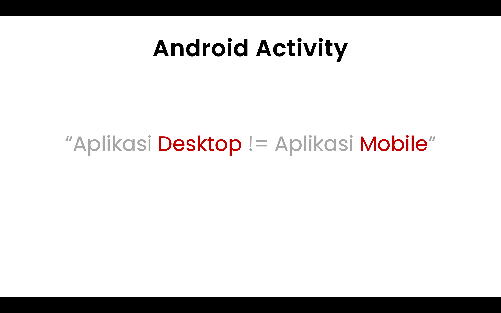
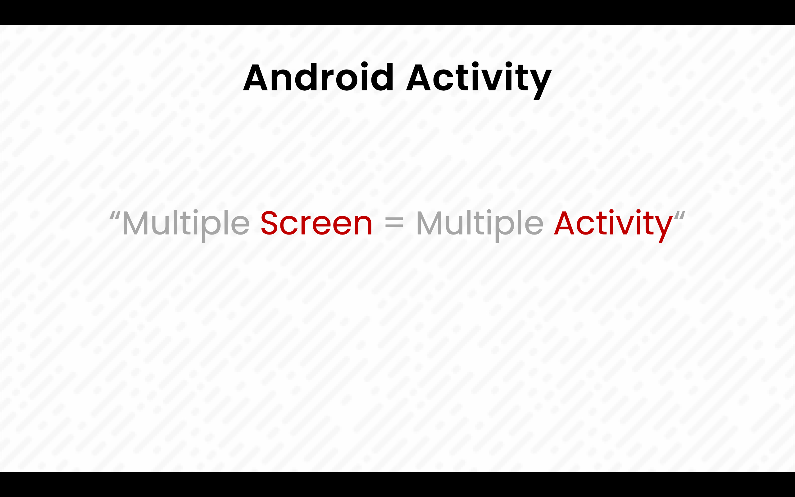
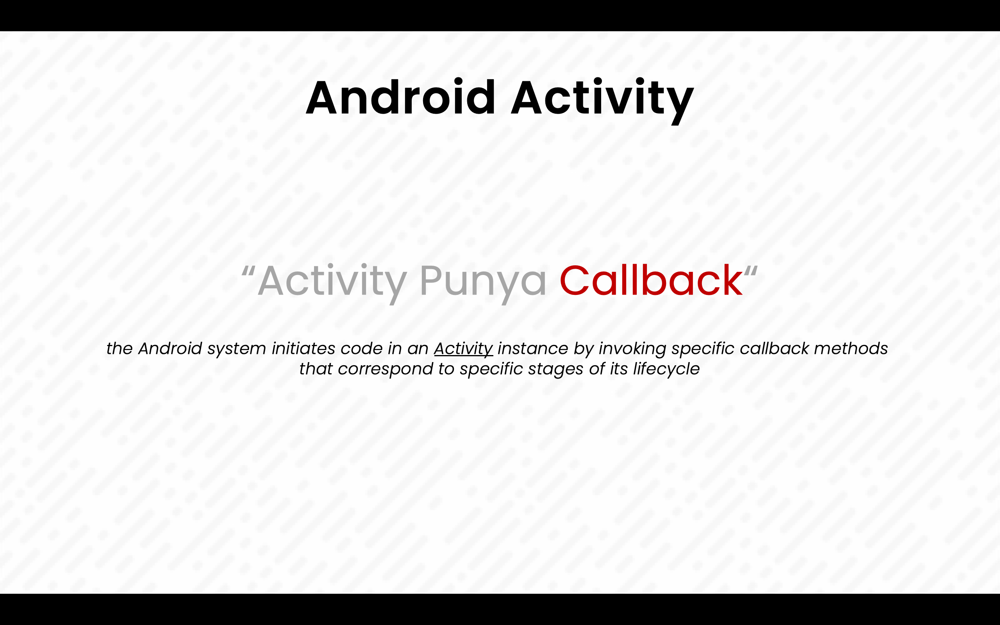
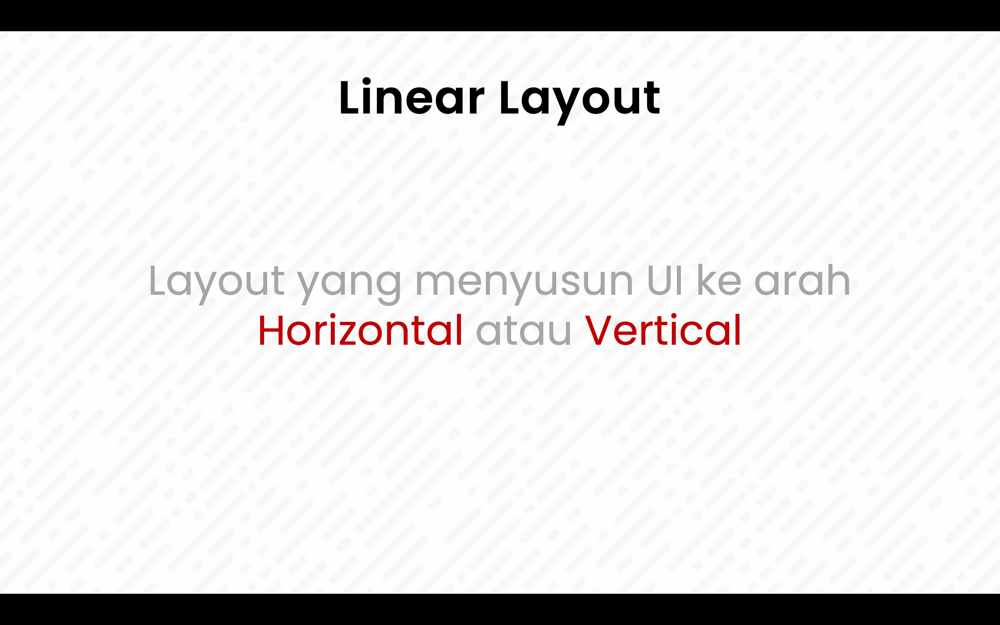
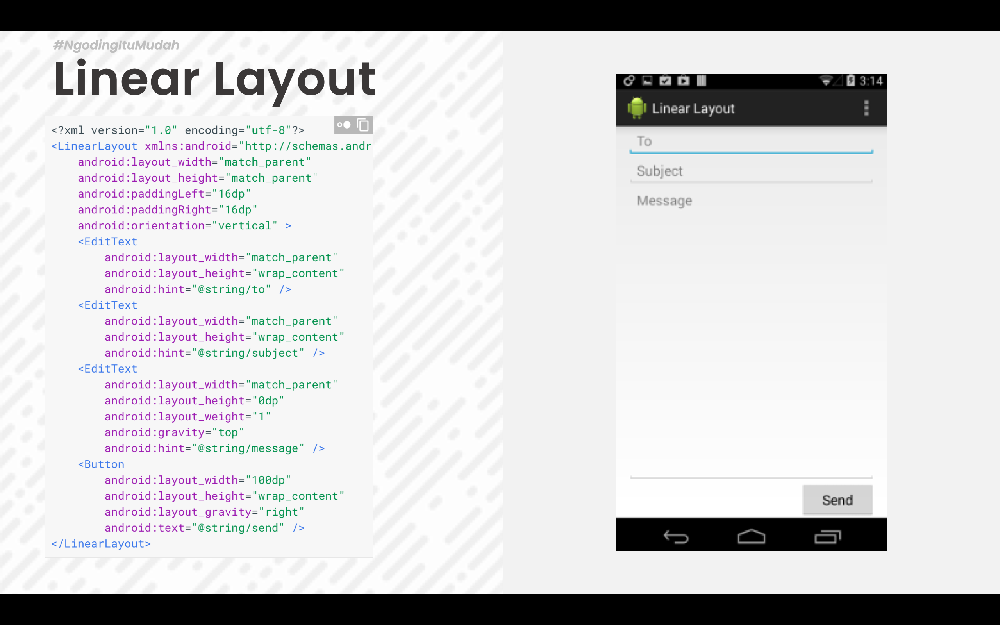
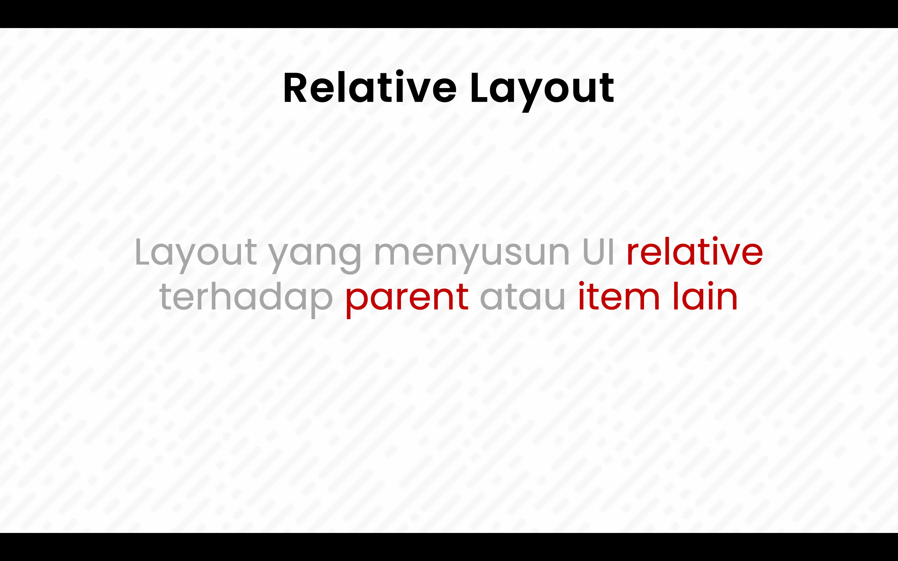
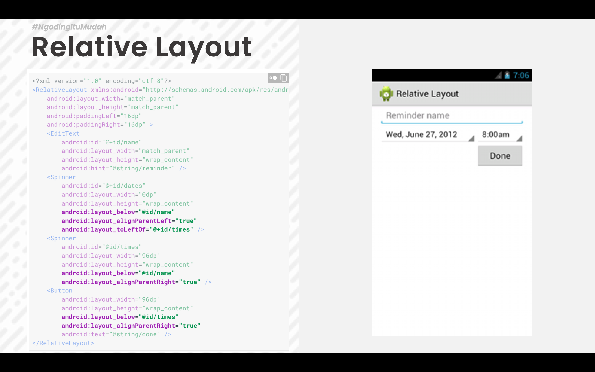
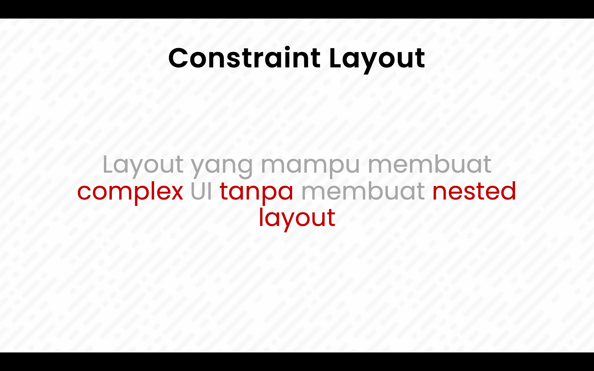

# Bab 2 Android Activity Lifecycle dan Layout

## Ringkasan Materi

Bab ini memberikan penjelasan mengenai Activity Lifecycle pada aplikasi android, bagaimana cara membuat project baru dan membuat berbagai macam layout yang umum digunakan pada aplikasi android.

## Tujuan Pembelajaran

Setelah mempelajari bab ini mahasiswa mampu memahami :

1. Activity Lifecycle
2. Android Linear Layout
3. Android Relative Layout
4. Android Constraint Layout

## Android Activity Lifecycle

Aplikasi mobile memiliki perbedaan yang signifikan dengan aplikasi berbasis desktop, salah satu perbedaan yang paling mencolok adalah alur dimulainya aplikasi, pada aplikasi desktop aplikasi selalu dimulai dengan proses yang berurutan sementara pada aplikasi mobile sebuah aplikasi dapat dimulai dari proses yang berbeda.
Contohnya adalah ketika kita membuka aplikasi email di android, aplikasi ini bisa dibuka dengan proses normal seperti pada aplikasi desktop, namun aplikasi email ini juga dapat dimulai dari proses yang berbeda contohnya ketika kita melakukan share image dari gallery ke aplikasi email, aplikasi email akan langsung membuka tampilan compose email tanpa harus membuka tampilan awal aplikasi.

> The mobile-app experience differs from its desktop counterpart in that a user's interaction with the app doesn't always begin in the same place. Instead, the user journey often begins non-deterministically. For instance, if you open an email app from your home screen, you might see a list of emails. By contrast, if you are using a social media app that then launches your email app, you might go directly to the email app's screen for composing an email.

Untuk lebih memahami kenapa aplikasi mobile berbeda dengan aplikasi desktop pahamilah contoh alur penggunaan aplikasi oleh seorang user pada aplikasi mobile dibawah ini :

Anggaplah sekarang anda sedang menggunakan aplikasi social media yang sering digunakan untuk sharing foto (instagram, facebook dll)

1. Ketika mengambil foto pada aplikasi social media bisa jadi aplikasi ini membuka aplikasi kamera untuk mengambil foto (aplikasi kamera ini terpisah dari aplikasi social media) jadi pada posisi ini seakan akan aplikasi social media mempunyai kamera yang terintegrasi padahal aplikasi ini memanggil aplikasi kamera bawaan sistem operasi android.
2. Kemudian ketika user sedang berada di aplikasi kamera, user dapat membuka aplikasi lain contohnya file manager atau aplikasi gallery.
3. Kemudian setelah selesai mengambil foto barulah pada akhirnya user kembali lagi kepada aplikasi social media.
4. Bisa jadi juga ketika sedang mengambil foto ternyata ada panggilan telepon masuk dimana panggilan ini secara otomatis mengaktifkan aplikasi telpon.

Jadi pada sistem operasi mobile diharapkan semua aplikasi dapat menangani interupsi sehingga user dapat kembali ke aplikasi lain dan melanjutkan hal yang sebelumnya dilakukan oleh user. Behavior user yang seperti ini membuat android menggunakan konsep `Activity` dimana pada activity ini memiliki berbagai macam `callback()` yang bertugas untuk menangani event event interupsi yang ada pada aplikasi mobile.

Aplikasi android yang dibuat biasanya minimal memiliki lebih dari satu layar tampilan, dimana untuk memfasilitasi behavior user pada aplikasi mobile yang sudah dijelaskan diatas maka untuk satu screen dibutuhkan satu activity. Sehingga pada umumnya sebuah aplikasi memiliki lebih dari satu activity.

Berikut ini callback yang ada pada sebuah `Activity`

| Activity Method | Deskripsi                                                                                                                                                                      | Next                      |
| --------------- | ------------------------------------------------------------------------------------------------------------------------------------------------------------------------------ | ------------------------- |
| onCreate()      | Ketika sebuah activity dibuat, pada method ini dilakukan inisialisasi seperti create view, list data, dll.                                                                     | onStart()                 |
| onRestart()     | Ketika sebuah activity dihentikan, dan merupakan prioritas untuk memanggil activity itu kembali.                                                                               | onStart()                 |
| onStart()       | Ketika sebuah activity dipanggil sebelum diperlihatkan ke user.                                                                                                                | onResume() / onStop()     |
| onResume()      | Ketika sebuah activity start/mulai melakukan interaksi dengan user, pada saat ini activity berada pada posisi teratas dari activity stack yang mana user akan melakukan input. | onPause()                 |
| onPause()       | Ketika sebuah activity lainnya dipanggil/dimulai, method ini digunakan ketika data tidak harus disimpan ke dalam sistem secara permanen.                                       | onResume() / onStop()     |
| onStop()        | Ketika sebuah acivity tidak lagi dibutuhkan/tidak terlihat lagi oleh user.                                                                                                     | onRestart() / onDestroy() |
| onDestroy()     | Ketika sebuah activity secara permanen tidak lagi dibutuhkan (activity dihancurkan). Dapat juga dilakukan dengan fungsi finish() / isFinishing().                              | -                         |

## Android Layout
Setiap activity akan mempunyai tampilan, untuk menyusun tampilan ada berbagai macam cara. Cara cara ini di himpun dalam sebuah tipe layout. Pada aplikasi android disediakan berbagai macam layout, untuk membuat sebuah tampilan yang digunakan oleh activity layout layout ini boleh digunakan sendiri sendiri atau digabung.

Pada perkuliahan kali ini akan dijelaskan beberapa layout yang sering digunakan dalam pembuatan aplikasi android.
### Linear Layout

Linear layout adalah layout yang menyusun UI ke arah horizontal atau vertical sesuai orientasi yang diberikan kepada layout ini.

Pada linear layout terdapat parameter wajib yaitu `orientation` yang mengatur orientasi dari sebuah linear layout apakah `vertical` atau `horizontal`. Semua child dari layout ini akan disusun mengikuti orientasi tersebut baik berupa tumpukan untuk orientasi `vertical` atau berbaris dari kiri ke kanan untuk orentasi `horizontal`

Pada contoh di atas merupakan kode xml untuk linear layout perhatikan lah beberapa attribut penting pada linear layout antara lain :
1. orientation
2. weight_sum
3. leyout_weight 

### Relative Layout

Relative layout adalah layout yang menyusun UI dengan memposisikan item relative terhadap parent atau item lain. Pada relative layout sebuah item UI selalu memiliki informasi posisinya relative terhadap parent atau relative terhadap item lain jika tidak memiliki atribut posisi ini maka item tersebut akan di posisikan di pojok kiri atas atau posisi 0,0 dari layout.

Pada contoh diatas merupakan kode xml untuk relative layout, pada layout ini ada beberapa attribut yang perlu diperhatikan antara lain :
1. layout_below
2. layout_alignParentLeft
3. layout_toLeftOf
4. dll

Pada umumnya attribut layout_xxx akan mengatur posisi relatif sebuah item pada layot.

### Constraint Layout

Constraint layout merupakan layout yang memiliki kemiripan dengan Relative Layout namun mempunyai kelebihan dibandingkan dengan Relavite Layout dalam fleksibelitas dan kemudahan dalam membuat layout secara langsung melalui layout editor bawaan android studio.

Constraint layout mampu membuat layout yang complex tanpa harus melakukan nested layout. Layout ini juga lebih mudah dalam penggunaan nya karena dapat dibuat dengan menggunakan fitur drag and drop pada layout editor android studio.
