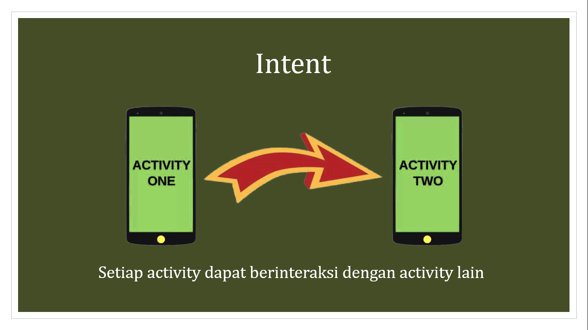
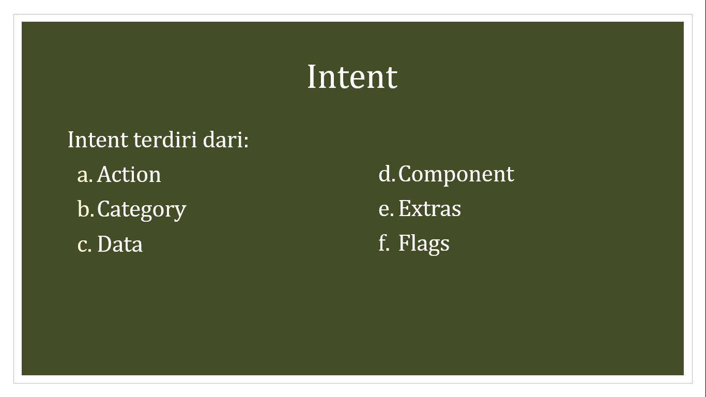
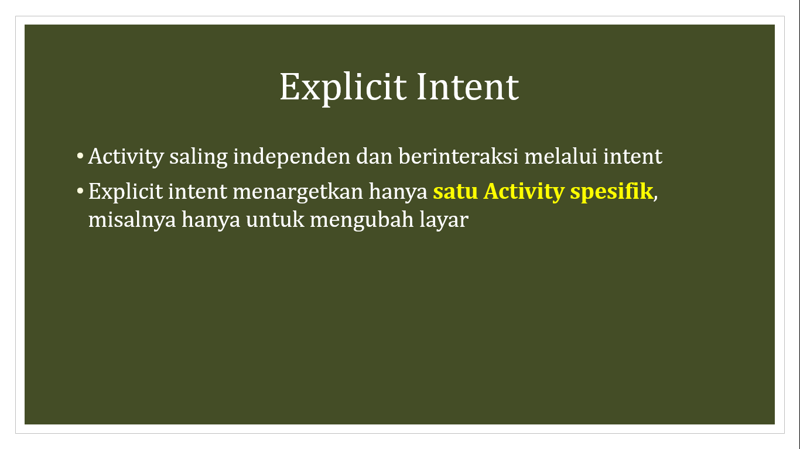
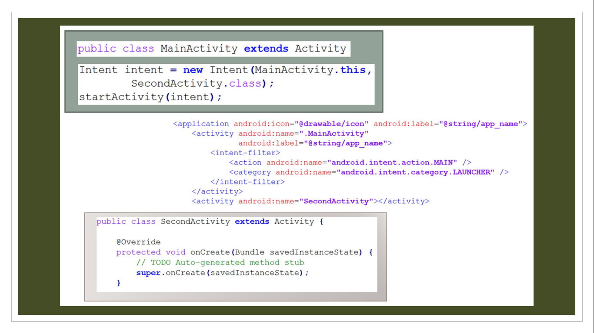
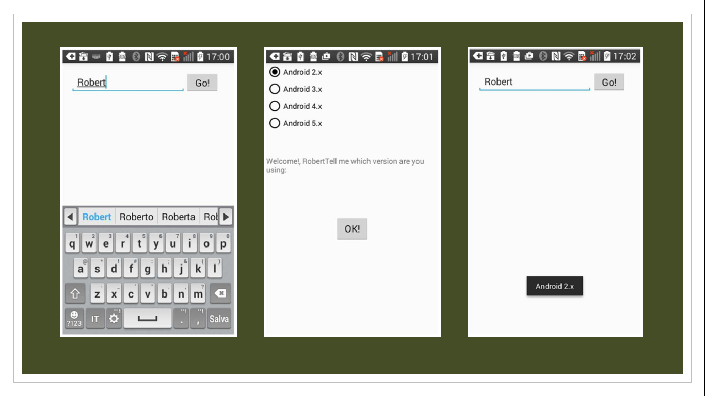
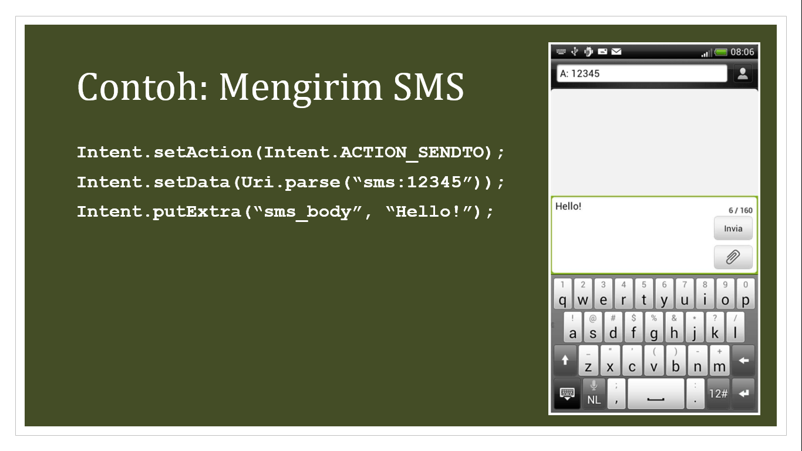

# Bab 4 Intent

## Ringkasan Materi

Bab ini memberikan penjelasan mengenai jenis-jenis Intent dan komponen-komponen yang terdapat di dalam Intent.

## Tujuan Pembelajaran

Setelah mempelajari bab ini mahasiswa mampu memahami :

1. Memahami Fungsi Intent
2. Menggunakan Fungsi Intent

## Intent



Sebuah aplikasi Android bisa terdiri dari nol atau lebih activity. Ketika aplikasi kita mempunyai lebih dari sebuah activity, maka kita perlu melakukan navigasi dari satu activity ke activity lainnya. Pada Android, melakukan navigasi di antara activity disebut dengan Intent. Intent merupakan sistem pesan utama yang menjalankan Android. Dengan adanya Intent, proses komunikasi dan berbagi data dapat dilakukan antar bagian dari sistem Android.
Secara umum kurang lebih intent digunakan seperti berikut:

```java
Intent i = new Intent (this, ActivityDua.class);
startActivity(i);
```

Pembuatan intent dilakukan pada Activity untuk memanggil Activity lainnya. Sebelum Activity berjalan, Activity tersebut harus dideklarasikan terlebih dahulu pada file Androidmanifest.xml agar Android dapat mengenail aplikasi tersebut. Contohnya:

```java
<activity android:name=”.ActivityDua”></activity>
```


## Komponen Intent

Sebuah objek Intent membawa informasi yang digunakan sistem Android untuk menentukan komponen mana yang akan dimulai (seperti nama komponen yang tepat atau kategori komponen yang harus menerima intent), ditambah informasi yang digunakan komponen penerima untuk melakukan tidak dengan benar (seperti aksi yang akan dilakukan dan data yang akan ditindaklanjuti).

Secara umum, informasi utama yang terkandung di dalam intent adalah sebagai berikut:
*	Action
*	Category
*	Data
*	Component
*	Extras
*	Flags



### a. Action

Action merupakan string yang menggambarkan operasi (aksi) yang akan dilakukan. Berikut ini beberapa tindakan umum untuk memulai suatu Activity:

`ACTION_VIEW`

Kita dapat menggunakan aksi ini di dalam Intent dengan `startActivity()` ketika kita mempunyai beberapa informasi yang dapat ditampilkan oleh Activity ke pengguna, seperti foto untuk dilihat di aplikasi galeri, atau alamat untuk dilihati di aplikasi peta.

`ACTION_SEND`

Aksi ini disebut juga dengan share intent. Kita harus menggunakan aksi ini di dalam sebuah Intent dengan `startActivity()` ketika kita mempunyai beberapa data yang akan dibagikan oleh pengguna melalui aplikasi lain, seperti aplikasi email atau aplikasi social sharing.

### b. Category

Category merupakan string yang menggambarkan informasi tambahan tentang komponen yang dapat mengelola Intent.
Sejumlah kategori deskripsi dapat ditempatkan di dalam sebuah Intent, tetapi kebanyakan Intent tidak membutuhkan kategori. Berikut ini adalah beberapa kategori yang umum digunakan:

`CATEGORY_BROWSABLE`

Activity target memungkinkan dirinya dimulai oleh browser web untuk menampilkan data yang dirujuk oleh sebuah link, seperti gambar atau pesan email.

`CATEGORY_LAUNCHER`

Activity adalah aktivitas awal dari sebuah task dan didaftar di dalam launcher aplikasi sistem.

### c. Data

Sebuah objek URI (Uniform Resource Identifier) yang mereferensikan data untuk digunakan. Jenis data yang diberikan umumnya ditentukan oleh aksi intent. Misalnya, jika aksina adalah `ACTION_EDIT`, maka data harus berisi URI dokumen yang akan diedit.

### d. Component

Nama komponen untuk memulai (digunakan ketika komponen yang bisa menangani Intent diketahui). Nama komponen ini bersifat optional, tetapi ini merupakan informasi penting yang membuat intent menjadi explicit, artinya Intent harus dikirimkan hanya ke komponen aplikasi yang ditentukan oleh nama komponen. Tanpa nama komponen, intent menjadi implicit dan sistem memutukan komponen mana yang ahrus menerima Intent berdasarkan pada informasi Intent yang lain (misalnya aksi, data, dan kategori).

### e. Extras

Pasangan key-value untuk membawa informasi tambahan yang dibutuhkan untuk melakukan aksi yang diminta. Seperti halnya beberapa aksi yang menggunakan jenis data URI, beberapa aksi juga menggunakan extra tertentu.

Kita dapat menambahkan data tambahan dengan berbagai method `putExtra()`, masing-masing menerima dua parameter: key dan value. Kita juga bisa membuat objek Bundle dengan semua data tambahan, kemudian memasukkan Bundle di Intent dengan `putExtras()`.

Sebagai contoh, ketika membuat sebuah Intent untuk mengirimkan email dengan `ACTION_SEND`, kita dapat menentukan “to recipient” dengan key `EXTRA_EMAIL`, dan menentukan subjek dengan key `EXTRA_SUBJECT`.

### f. Flags

Flags dapat menginstruksikan sistem Android tentang cara untuk meluncurkan sebuah activity (sebagai contoh, task mana yang seharusnya dimiliki oleh aktivitas tersebut) dan bagaimana cara untuk memperlakukannya setelah diluncurkan (sebagai contoh, apakah task tersebut termasuk di dalam daftar aktivitas terbaru).


## Penggunaan Intent

Gambar 1 menunjukkan bagaimana intent digunakan ketika memulai sebuah activity. Ketika objek Intent memberi nama komponen aktivitas secara eksplisit, sistem segera memulai komponen tersebut.


###### Gambar 1. Penggunaan Intent

Gambar 1 menunjukkan bagaimana implicit intent dikirimkan melalui sistem untuk memulai aktivitas lain:

1. Aktivitas A membuat intent dengan deskripsi aksi dan meneruskannya ke startActivity()
2. Sistem Android mencari semua aplikasi untuk filter intent yang sesuai dengan intent
3. Sistem memulai mencocokkan aktivitas (Activity B) dengan menjalankan metode onCreate() dan meneruskannya dengan Intent

Ketika kita menggunakan implicit intent, sistem Android menemukan komponen yang tepat untuk dimulai dengan membandingkan konten intent dengan filter intent yang dideklarasikan di dalam manifest file aplikasi lain pada device. Jika intent cocok dengan filter intent, sistem memulai komponen itu dan mengirimkan objek Intent. Jika beberapa filter intent kompatibel (sesuai), sistem akan menampilkan kotak dialog sehingga pengguna dapat memilih aplikasi mana yang akan digunakan.

Intent filter adalah ekspresi di dalam manifest file aplikasi yang menentukan jenis intent yang ingin diterima oleh komponen. Misalnya, dengan mendeklarasikan filter intent untuk sebuah aktivitas, kita memungkinkan aplikasi lain untuk langsung memulai aplikasi kita dengan jenis intent tertentu. Demikian halnya jika kita tidak mendeklarasikan filter intent untuk sebuah aktivitas, maka ini dapat dimulai hanya dengan explicit intent.


## Jenis Intent

Intent terdiri dari dua jenis yaitu Explicit Intent dan Implicit Intent. Explicit intent adalah intent yang targetnya kita ketahui, artinya kita sudah mengetahui nama class yang sepenuhnya memenuhi syarat dari aktivitas spesifik tersebut. Implicit intent adalah intent yang nama komponen targetnya tidak kita ketahui, namun memiliki tindakan umum untuk dikerjakan.


Explicit Intent menentukan aplikasi mana yang akan memenuhi Intent, dengan menyediakan nama paket aplikasi target atau nama class komponen. Kita biasanya akan menggunakan explicit intent untuk memulai komponen di aplikasi kita sendiri karena kita tahu nama class dari activity atau layanan yang ingin dimulai. Misalnya, kita dapat memulai aktivitas baru di dalam aplikasi sebagai respons terhadap aksi pengguna, atau memulai layanan untuk mengunduh file di background.

Implicit Intent tidak menyebutkan nama komponen tertentu, tetapi menyatakan aksi yang akan dilakukan, yang memungkinkan komponen dari aplikasi lain untuk menanganinya. Misalnya, jika kita ingin menunjukkan kepada pengguna sebuah lokasi di peta, kita dapat menggunakan implicit intent untuk meminta aplikasi lain yang mempu menampilkan lokasi yang ditentukan pada peta.

### Explicit Intent

Explicit intent mengaktifkan aktivitas spesifik dalam aplikasi kita atau aplikasi berbeda dengan mengirimkan intent dengan nama kelas mutlak dari aktivitas tersebut.


 
Explicit Intent memberitahukan sistem Android untuk menjalankan sebuah komponen spesifik, misalnya ActivityB. Jika terdapat ActivityA yang akan memanggil ActivityB, maka cara penggunaannya adalah sebagai berikut:

```java
Intent i = new Intent(ActivityA.this, ActivityB.class);
startActivity(i);
```



Misalkan pada MainActivity terdapat potongan kode sebagai berikut:

```java
Intent intent = new Intent(MainActivity.this, SecondActivity.class);
startActivity(intent);
```

Pada potongan kode program tersebut, SecondActivity merupakan target komponen dari MainActivity, yang artinya SecondActivity adalah komponen yang akan dipanggil oleh Android. Intent memfasilitasi kita untuk mengarahkan activity kita ke activity lain dengan memanggil `startActivity()`.



Contoh penggunaan explicit intent sering kali digunakan pada proses registrasi, login, dan sebagainya. Sebagai contoh, misalkan pada activity pertama kita mengisikan nama "*Robert*", kemudian mengirimkan data ke activity kedua dan menampilkannya, sehingga terdapat kata "*Robert*" pada activity kedua. Selain itu, pada activity kedua kita juga mengisikan "*Android 2.x*", kemudian mengirimkannya kembali ke activity pertama dan menampilkannya. Dengan demikian, pada activity pertama terdapat kata "*Android 2.x*".


### Implicit Intent

Implicit intent memungkinkan kita untuk mengaktifkan aktivitas jika tahu tindakannya, tetapi tidak tahu aplikasi spesifik atau aktivitas yang akan menangani tindakan tersebut. Contohnya, jika kita ingin aplikasi mengambil foto, atau mengirim email, atau menampilkan lokasi pada peta, kita biasanya tidak peduli aplikasi atau aktivitas spesifik mana yang melakukan tindakan ini. Pada kondisi inilah kita menggunakan implicit intent.


Implicit intent menentukan aksi yang harus dijalankan dan data opsional yang menyediakan konten untuk tindakan tersebut. Misalnya, kita ingin memberitahu sistem Android untuk melihat halaman web. Semua browser web yang terinstal harus didaftarkan ke intent yang sesuai melalui sebuah filter intent. Contoh penggunaan Intent adalah sebagai berikut:

```java
Intent i = new Intent(Intent.ACTION_VIEW, Uri.parse("http:// www.polinema.ac.id"));
startActivity(i);
```

Jika implicit intent dikirim ke sistem Android, dia akan mencari semua komponen yang terdaftar untuk aksi spesifik dan tipe data yang sesuai.

Jika hanya satu komponen yang ditemukan, Android memulai komponen ini secara langsung. Jika beberapa komponen diidentifikasi oleh sistem Android, pengguna akan mendapatkan dialog pemilihan dan dapat memutuskan komponen mana yang harus digunakan untuk Intent tersebut.


NO | ACTION | PENJELASAN
---|---|---
1|ACTION_MAIN|Menampilkan home screen
2|ACTION_VIEW|Menampilkan data ke pengguna. Ketika digunakan pada daftar kontak, maka akan menampilkan daftar. Ketika digunakan dengan tel: URI maka akan memanggil dialer, contohnya ACTION_VIEW tel:12345 maka akan menampilkan dialer telepon dengan nomer yang sudah terisi 12345
3|ACTION_ATTACH_DATA|Digunakan untuk menunjukkan bahwa sebagian data harus dilampirkan ke tempat lain. Misalnya data gambar dapat dilampirkan ke kontak
4|ACTION_EDIT	|Memberikan akses dapat diedit secara eksplisit ke data yang diberikan
5	|ACTION_PICK	|Memilih item dari data, mengembalikan informasi yang terpilih
6|ACTION_CHOOSER	|Menampilkan pemilih activity, yang memungkinkan pengguna untuk memilih apa yang mereka inginkan sebelum melanjutkan
7	|ACTION_GET_CONTENT	|Memungkinkan pengguna untuk memilih jenis data tertentu dan mengembalikannya. Action ini memungkinkan pengguna untuk membuat data saat berjalan, misalnya mengambil gambar atau merekam suara, memperbolehkan pengguna untuk menjelajah website dan mengunduh data yang diinginkan, dll
8	|ACTION_DIAL	|Menekan nomer telepon yang ditentukan oleh data, memungkinkan pengguna untuk secara eksplisit memulai panggilan
9	|ACTION_CALL	|Melakukan panggilan ke seseorang yang ditentukan oleh data
10	|ACTION_SEND	|Mengirimkan beberapa data ke orang lain. Penerima data tidak ditentukan, tetapi hanya menentukan letak data yang harus dikirimkan
11	|ACTION_SENDTO	|Mengirim pesan ke seseorang yang ditentukan oleh data. Pesan yang dikirimkan tidak harus berupa email, tetapi juga bisa berupa SMS, MMS, atau XMPP
12	|ACTION_ANSWER	|Menangani panggilan telepon masuk
13	|ACTION_INSERT	|Memasukkan item kosong ke dalam tempat yang diberikan
14	|ACTION_SEARCH	|Melakukan pencarian



Untuk mengirimkan sebuah SMS, kita dapat menggunakan ACTION_SENDTO. Dengan menggunakan action ini kita dapat mengatur siapa penerima pesan. Berikut ini adalah contoh kode program implicit intent yang digunakan untuk mengirim SMS:

```java
Intent.setAction(Intent.ACTION_SENDTO);
Intent.setData(Uri.parse(“sms:12345”));
Intent.putExtra(“sms_body”, “Hello!”);
```

`Intent.setData(Uri.parse(“sms:12345”));` berfungsi untuk menentukan nomer telepon tujuan. Karena kita akan mengirimkan SMS, maka ditambahkan "SMS" sebelum nomer telepon tujuan. Kemudian `Intent.putExtra(“sms_body”, “Hello!”);` berfungsi untuk menyertakan data tambahan berupa sms_body yang berisi kata "*Hello!*".
